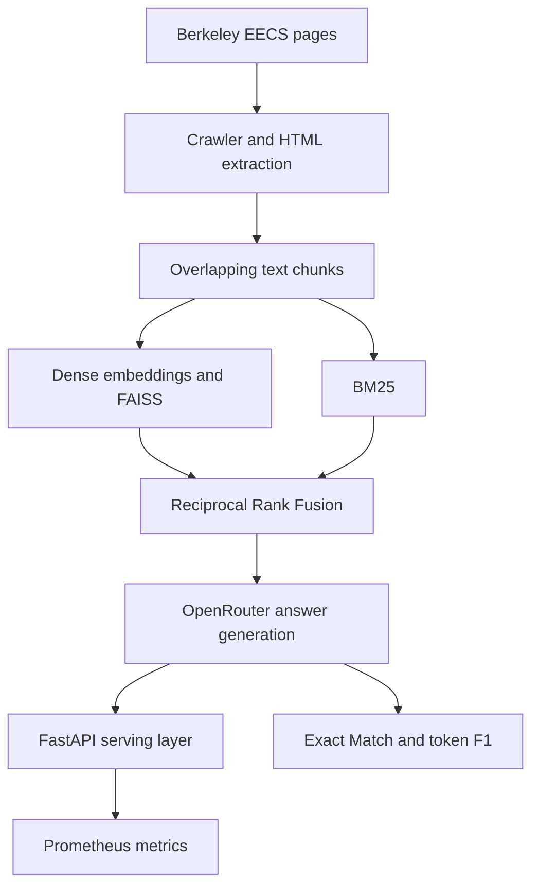

# BuildYourOwnRAG

[](https://github.com/RishbhaJain/BuildYourOwnRAG/actions/workflows/ci.yml)

A production-style retrieval-augmented generation system for factual question answering over the UC Berkeley EECS web corpus. It covers the full ML lifecycle: responsible crawling, content extraction, hybrid retrieval, answer generation, evaluation, online serving, containerization, and latency observability.

## Results

### Answer quality

| Benchmark snapshot | Questions | Exact Match | Token F1 |
|---|---:|---:|---:|
| Checked-in `predictions.txt` | 100 | **55.00%** | **65.86%** |

Reproduce the quality metrics with:

```bash
python run_evaluation.py predictions.txt
```

The evaluator applies SQuAD-style normalization, reports normalized exact match and token-level F1, and supports multiple reference answers.

### Serving overhead

| Configuration | Requests | p50 latency | p95 latency | Throughput |
|---|---:|---:|---:|---:|
| Deterministic mocked retrieval and generation | 1,000 | **0.493 ms** | **0.758 ms** | **1,827.68 req/s** |

This reference benchmark isolates FastAPI and orchestration overhead. It does not represent embedding-model or OpenRouter latency. Reproduce it with:

```bash
python -m benchmarks.benchmark_service --iterations 1000 --warmup 50
```

### Live end-to-end benchmark

The live benchmark drives the production API over the existing question set at
concurrency 1, 4, and 8. It records end-to-end p50/p95 latency, true streamed
time to first token, throughput, completion tokens per second, fallback and
failure categories, provider-reported cost per question, and cache hit rate.

```bash
export OPENROUTER_API_KEY="your-key"
export RAG_AUTO_DOWNLOAD_MODEL=1
uvicorn service.app:app --host 0.0.0.0 --port 8000

python -m benchmarks.benchmark_live \
  --questions questions.txt \
  --limit 100 \
  --concurrency 1,4,8 \
  --output benchmarks/results/live_service.json
```

The run compares uncached requests against the same workload after warming the
bounded TTL response cache. It never substitutes mock latency for live-model
results. Provider usage is read from OpenRouter's streamed response rather than
estimated from a local tokenizer.

## Architecture



## Engineering highlights

- **Responsible crawling:** domain allowlists, `robots.txt` checks, per-domain rate limiting, retries, redirect handling, and persistent storage.
- **Resilient extraction:** structural extraction with Resiliparse plus a BeautifulSoup fallback for malformed or heterogeneous pages.
- **Hybrid retrieval:** normalized dense embeddings in a FAISS inner-product index combined with BM25 through Reciprocal Rank Fusion.
- **Efficient inference path:** the embedding model, FAISS index, corpus, and BM25 state load once at process startup.
- **Measured online serving:** FastAPI endpoints return selected chunk IDs plus embedding, dense retrieval, BM25, fusion, generation, and total latency.
- **Operational visibility:** Prometheus counters, readiness state, request/failure/fallback rates, and per-stage latency histograms.
- **Measured optimization:** a bounded TTL response cache reports hit/miss/bypass metrics and avoids repeat retrieval, generation, token usage, and provider cost.
- **Deployment path:** a non-root Docker image with liveness checks and a credential-free mock mode for CI.
- **Reproducible evaluation:** a checked-in 100-question benchmark, multi-reference scoring, focused tests, and container smoke checks in GitHub Actions.

## Quick start

### 1. Create an environment

```bash
git clone https://github.com/RishbhaJain/BuildYourOwnRAG.git
cd BuildYourOwnRAG

python3 -m venv .venv
source .venv/bin/activate
python -m pip install -r requirements.txt
```

### 2. Configure generation

The generator calls OpenRouter:

```bash
export OPENROUTER_API_KEY="your-key"
```

### 3. Run the offline hybrid pipeline

```bash
bash run.sh questions.txt predictions.local.txt
python run_evaluation.py predictions.local.txt
```

`run.sh` downloads the embedding model if needed, reconstructs the FAISS index from the checked-in embeddings, runs hybrid retrieval, and writes one answer per question.

You can also invoke the Python entry point directly:

```bash
python run_pipeline.py questions.txt predictions.local.txt \
  --retriever hybrid \
  --top-k 20 \
  --workers 10
```

## Run the online API

Install the serving dependencies, then start Uvicorn:

```bash
python -m pip install -r requirements-service.txt
export RAG_AUTO_DOWNLOAD_MODEL=1
uvicorn service.app:app --host 0.0.0.0 --port 8000
```

Production startup loads the model and retrieval state once. If `data/faiss_index.bin` is absent, the service rebuilds it from the checked-in embeddings before reporting ready.

Check health and readiness:

```bash
curl http://localhost:8000/health
curl http://localhost:8000/ready
```

Request an answer:

```bash
curl -X POST http://localhost:8000/answer \
  -H "Content-Type: application/json" \
  -d '{"question":"Who leads the GamesCrafters group?","top_k":5}'
```

The response includes the answer, fallback status, selected chunk IDs, and stage timings:

```json
{
  "answer": "Dan Garcia",
  "retrieved_chunk_ids": ["chunk-123", "chunk-456"],
  "fallback": false,
  "cache_hit": false,
  "provider_called": true,
  "prompt_tokens": 612,
  "completion_tokens": 4,
  "total_tokens": 616,
  "estimated_cost_usd": 0.00012,
  "ttft_ms": 184.7,
  "timings_ms": {
    "embedding": 18.4,
    "dense_retrieval": 2.1,
    "bm25_retrieval": 7.8,
    "fusion": 0.1,
    "generation": 312.6,
    "total": 341.2
  }
}
```

The numbers above illustrate the response schema rather than a measured live-model run.

### Prometheus metrics

```bash
curl http://localhost:8000/metrics
```

The endpoint exposes:

- `rag_requests_total{status=...}`
- `rag_request_failures_total`
- `rag_fallbacks_total`
- `rag_cache_requests_total{result=...}`
- `rag_provider_tokens_total{type=...}`
- `rag_provider_cost_usd_total`
- `rag_request_latency_seconds`
- `rag_stage_latency_seconds{stage=...}`
- `rag_service_ready`

Prometheus can calculate p50 and p95 latency from the request and stage histograms.

## Run with Docker

Build the full production image:

```bash
docker build -t build-your-own-rag .
docker run --rm -p 8000:8000 --env-file .env build-your-own-rag
```

The image runs as a non-root user and includes a `/health` container health check. The first production startup may download the embedding model and rebuild the FAISS index.

For a fast credential-free smoke test:

```bash
docker build --build-arg INSTALL_ML_DEPS=0 -t build-your-own-rag:mock .
docker run --rm -p 8000:8000 -e RAG_MODE=mock build-your-own-rag:mock
```

Mock mode exists only for integration testing. It does not report model quality or live inference performance.

## Test and benchmark

```bash
python -m pip install -r requirements-dev.txt
python -m pytest -q \
  tests/test_evaluation.py \
  tests/test_cache.py \
  tests/test_llm.py \
  tests/test_live_benchmark.py \
  tests/test_service_pipeline.py \
  tests/test_service_api.py
python -m benchmarks.benchmark_service
```

These tests require no model download, external service, or API key. CI also builds the mock container, waits for readiness, sends an end-to-end request, and verifies the metrics endpoint.

## Repository map

| Path | Purpose |
|---|---|
| `crawler/` | Crawl approved EECS domains while respecting site policies |
| `cleaner/` | Extract main text and remove boilerplate |
| `chunker/` | Create overlapping passage chunks |
| `embedder/` | Produce normalized dense embeddings |
| `retriever/` | Dense retrieval, BM25 retrieval, and rank fusion |
| `llms/` | Build grounded prompts and generate concise answers |
| `service/` | Load-once pipeline, FastAPI endpoints, and Prometheus metrics |
| `benchmarks/` | Reproducible mock serving benchmark and result artifacts |
| `run_pipeline.py` | Orchestrate offline retrieval and parallel generation |
| `run_evaluation.py` | Compute exact match and token F1 |
| `tests/` | Unit and integration tests |
| `Dockerfile` | Production and mock-mode container build |

## Key design choices

- Passages default to 200 words with 50 words of overlap.
- Dense vectors are L2-normalized, so inner product in FAISS corresponds to cosine similarity.
- Reciprocal Rank Fusion combines dense and lexical rankings without requiring score calibration.
- The service separates query embedding from FAISS search so both stages can be measured independently.
- Repeated successful queries are cached by normalized question and retrieval depth; `use_cache=false` provides an explicit uncached benchmark/control path.
- Liveness remains available when model initialization fails, while readiness correctly returns HTTP 503.
- API failures return a stable public error and keep backend details in server logs.

## Current limitations

- The benchmark contains 100 domain-specific factoid questions, so the scores do not imply performance on open-domain QA.
- Exact match and token F1 emphasize lexical overlap and can under-credit semantically equivalent answers.
- The committed latency benchmark measures deterministic serving overhead, not live model or provider latency.
- Full generation requires an OpenRouter key, local model storage, and enough memory for the embedding model.
- Authentication, rate limiting, distributed tracing, and multi-worker Prometheus aggregation are not yet implemented.
- Web content and reference answers are a point-in-time snapshot and should be refreshed before evaluating current facts.
