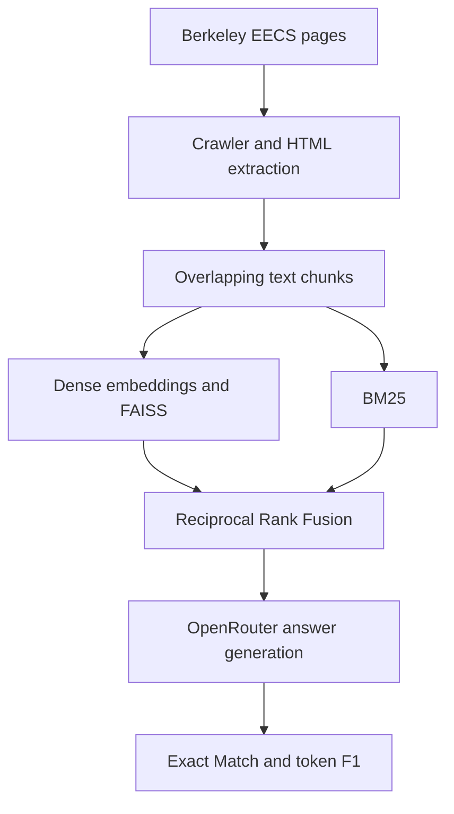

# BuildYourOwnRAG

[](https://github.com/RishbhaJain/BuildYourOwnRAG/actions/workflows/ci.yml)

An end-to-end retrieval-augmented generation system for factual question answering over the UC Berkeley EECS web corpus. It covers the full pipeline from responsible crawling and content extraction to hybrid retrieval, answer generation, and reproducible evaluation.

## Results

| Benchmark snapshot | Questions | Exact Match | Token F1 |
|---|---:|---:|---:|
| Checked-in `predictions.txt` | 100 | **55.00%** | **65.86%** |

Reproduce these values with:

```bash
python run_evaluation.py predictions.txt
```

The evaluator applies SQuAD-style normalization, reports normalized exact match and token-level F1, and supports multiple reference answers.

## Architecture



## Engineering highlights

- **Responsible crawling:** domain allowlists, `robots.txt` checks, per-domain rate limiting, retries, redirect handling, and persistent storage.
- **Resilient extraction:** structural extraction with Resiliparse plus a BeautifulSoup fallback for malformed or heterogeneous pages.
- **Hybrid retrieval:** normalized dense embeddings in a FAISS inner-product index combined with BM25 through Reciprocal Rank Fusion.
- **Efficient inference path:** batched query encoding and concurrent LLM generation with ordered output and failure fallbacks.
- **Reproducible evaluation:** a checked-in 100-question benchmark, multi-reference scoring, and credential-free metric tests in GitHub Actions.
- **Centralized configuration:** corpus, chunking, retrieval, model, and generation settings live in `config.py`.

## Quick start

### 1. Create an environment

```bash
git clone https://github.com/RishbhaJain/BuildYourOwnRAG.git
cd BuildYourOwnRAG

python3 -m venv .venv
source .venv/bin/activate
python -m pip install -r requirements.txt
```

### 2. Configure generation

The generator calls OpenRouter. Set your key in the shell before running the pipeline:

```bash
export OPENROUTER_API_KEY="your-key"
```

### 3. Run the hybrid RAG pipeline

```bash
bash run.sh questions.txt predictions.local.txt
python run_evaluation.py predictions.local.txt
```

`run.sh` downloads the embedding model if needed, reconstructs the FAISS index from the checked-in embeddings, runs hybrid retrieval, and writes one answer per question.

You can also invoke the Python entry point directly:

```bash
python run_pipeline.py questions.txt predictions.local.txt \
  --retriever hybrid \
  --top-k 20 \
  --workers 10
```

## Test the evaluation layer

The evaluation tests are intentionally lightweight. They require no model download, external service, or API key.

```bash
python -m pip install "pytest>=8,<10"
python -m pytest -q tests/test_evaluation.py
```

## Repository map

| Path | Purpose |
|---|---|
| `crawler/` | Crawl approved EECS domains while respecting site policies |
| `cleaner/` | Extract main text and remove boilerplate |
| `chunker/` | Create overlapping passage chunks |
| `embedder/` | Produce normalized dense embeddings |
| `retriever/` | Dense retrieval, BM25 retrieval, and rank fusion |
| `llms/` | Build grounded prompts and generate concise answers |
| `run_pipeline.py` | Orchestrate retrieval and parallel generation |
| `run_evaluation.py` | Compute exact match and token F1 |
| `tests/` | Unit tests for pipeline components and evaluation |

## Key design choices

- Passages default to 200 words with 50 words of overlap.
- Dense vectors are L2-normalized, so inner product in FAISS corresponds to cosine similarity.
- Reciprocal Rank Fusion combines dense and lexical rankings without requiring score calibration.
- Generation defaults to deterministic sampling and returns `Unknown` when no grounded answer can be produced.

## Current limitations

- The benchmark contains 100 domain-specific factoid questions, so the scores do not imply performance on open-domain QA.
- Exact match and token F1 emphasize lexical overlap and can under-credit semantically equivalent answers.
- Full generation requires an OpenRouter key and local embedding-model storage.
- Web content and reference answers are a point-in-time snapshot and should be refreshed before evaluating current facts.
